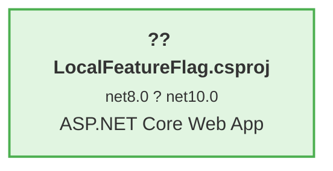

# .NET 8 ? .NET 10 Upgrade Plan

## Table of Contents

- [Executive Summary](#executive-summary)
- [Migration Strategy](#migration-strategy)
- [Detailed Dependency Analysis](#detailed-dependency-analysis)
- [Project-by-Project Plans](#project-by-project-plans)
  - [LocalFeatureFlag.csproj](#localfeatureflagcsproj)
- [Package Update Reference](#package-update-reference)
- [Breaking Changes Catalog](#breaking-changes-catalog)
- [Risk Management](#risk-management)
- [Testing & Validation Strategy](#testing--validation-strategy)
- [Complexity & Effort Assessment](#complexity--effort-assessment)
- [Source Control Strategy](#source-control-strategy)
- [Success Criteria](#success-criteria)

---

## Executive Summary

### Scenario Description

This plan outlines the upgrade of the **FeatureFlag** solution from **.NET 8.0** to **.NET 10.0 (Long Term Support)**. The solution consists of a single ASP.NET Core web application that implements feature flag management using Entity Framework Core with SQLite.

### Scope

**Projects Affected**: 1 project
- **LocalFeatureFlag.csproj** - ASP.NET Core Web Application (Razor Pages)

**Current State**:
- Target Framework: .NET 8.0
- 4 NuGet packages (2 compatible, 2 requiring upgrade)
- 350 lines of code across 25 files
- Entity Framework Core 8.0.8 with SQLite provider
- Feature management using Microsoft.FeatureManagement 3.5.0

**Target State**:
- Target Framework: .NET 10.0
- All packages compatible with .NET 10.0
- Entity Framework Core 10.0.2
- 1 behavioral change addressed

### Selected Strategy

**All-At-Once Strategy** - All updates applied simultaneously in a single atomic operation.

**Rationale**: 
- Single project with no internal dependencies
- Small codebase (350 LOC)
- Simple, clear structure
- All packages have .NET 10.0-compatible versions available
- No security vulnerabilities to address
- Low complexity enables coordinated update

### Complexity Assessment

**Discovered Metrics**:
- Projects: 1
- Dependency Depth: 0 (standalone project)
- Package Updates Required: 2
- API Compatibility Issues: 1 (behavioral change)
- Security Vulnerabilities: 0
- Estimated LOC Impact: 1+ lines (0.3% of codebase)

**Classification**: **Simple**

This is a straightforward upgrade with minimal risk. The single project structure, absence of dependencies, small codebase, and lack of security vulnerabilities make this an ideal candidate for the All-At-Once approach.

### Critical Issues

**None** - No blocking issues identified. The single behavioral change detected is related to `UseExceptionHandler` endpoint routing configuration, which is a low-impact runtime consideration that can be validated through testing.

### Recommended Approach

Execute the upgrade as a single atomic operation:
1. Update project target framework to .NET 10.0
2. Update Entity Framework Core packages to 10.0.2
3. Restore dependencies
4. Build and address any compilation issues
5. Validate behavioral change impact through testing
6. Commit all changes as a single unit

### Iteration Strategy

**Fast Batch Approach** - Given the simple classification, this plan will be generated in 2-3 focused iterations covering all project details in a single pass.

---

## Migration Strategy

### Approach Selection

**Selected: All-At-Once Strategy**

This upgrade will be executed as a single atomic operation where all framework and package updates are applied simultaneously.

**Justification**:

? **Simple Structure**: Single project with zero internal dependencies
? **Small Codebase**: 350 lines of code enables rapid verification
? **Clear Compatibility**: All packages have known .NET 10.0 versions
? **Low Risk**: No security vulnerabilities, minimal API changes
? **Fast Execution**: Atomic approach minimizes total upgrade time
? **Clean State**: No intermediate multi-targeting complexity needed

### All-At-Once Strategy Rationale

The All-At-Once approach is ideal for this solution because:

1. **No Dependency Constraints**: With only one project, there are no dependency ordering concerns
2. **Unified Testing**: The entire application can be tested as a complete unit after the upgrade
3. **Single Deployment**: No need to coordinate multiple project releases
4. **Reduced Overhead**: Avoids the complexity of managing intermediate states
5. **Developer Efficiency**: All team members transition to .NET 10.0 simultaneously

### Dependency-Based Ordering

**Not Applicable** - The single project structure eliminates dependency ordering requirements. The entire upgrade occurs in one phase.

### Execution Approach

**Atomic Upgrade in Single Phase**:

All operations will be performed as a coordinated batch:
1. Update project file `TargetFramework` to `net10.0`
2. Update Entity Framework Core packages to version 10.0.2
3. Restore all dependencies
4. Build solution to identify compilation errors
5. Address any compilation errors or breaking changes
6. Rebuild to verify fixes
7. Execute tests to validate behavioral changes
8. Commit all changes as single unit

**No Parallelization Needed** - Single project upgrade is inherently sequential.

### Risk Management Approach

Given the low complexity and risk profile:
- Execute all updates in single operation
- Build verification identifies any breaking changes immediately
- Test suite validates behavioral change impact
- Single atomic commit enables clean rollback if needed

### Timeline

**Single Phase Execution**:

**Phase 1: Atomic Upgrade**
- Update project file and packages
- Build and fix compilation issues
- Validate through testing
- **Deliverable**: Solution builds successfully on .NET 10.0 with all tests passing

---

## Detailed Dependency Analysis

### Dependency Graph Summary

The solution contains a single standalone project with no internal project dependencies.



**Legend**:
- ?? SDK-style project
- Green: Upgrade target

### Project Groupings by Migration Phase

**Phase 1: Atomic Upgrade** (All projects simultaneously)
- LocalFeatureFlag.csproj

### Critical Path Identification

**No critical path exists** - The single project structure means there are no dependency chains to consider. The entire upgrade can be executed as one atomic operation.

### Circular Dependencies

**None detected** - No circular dependencies exist in this solution.

### External Dependencies

The project depends on the following external NuGet packages:
- **Microsoft.EntityFrameworkCore** (8.0.8 ? 10.0.2)
- **Microsoft.EntityFrameworkCore.Sqlite** (8.0.8 ? 10.0.2)
- **Microsoft.FeatureManagement** (3.5.0 - Compatible)
- **Microsoft.FeatureManagement.AspNetCore** (3.5.0 - Compatible)

All packages have confirmed .NET 10.0 compatibility.

---

## Project-by-Project Plans

### LocalFeatureFlag.csproj

**Project Type**: ASP.NET Core Web Application (Razor Pages)

**Current State**:
- Target Framework: net8.0
- SDK-style: True
- Lines of Code: 350
- Files: 25
- Dependencies: 0 internal projects
- NuGet Packages: 4 (2 requiring upgrade)
  - Microsoft.EntityFrameworkCore 8.0.8
  - Microsoft.EntityFrameworkCore.Sqlite 8.0.8
  - Microsoft.FeatureManagement 3.5.0
  - Microsoft.FeatureManagement.AspNetCore 3.5.0

**Target State**:
- Target Framework: net10.0
- NuGet Packages: 4 (all compatible)
  - Microsoft.EntityFrameworkCore 10.0.2
  - Microsoft.EntityFrameworkCore.Sqlite 10.0.2
  - Microsoft.FeatureManagement 3.5.0 (no change needed)
  - Microsoft.FeatureManagement.AspNetCore 3.5.0 (no change needed)

---

### Migration Steps

#### 1. Prerequisites

**Verify .NET 10.0 SDK Installation**:
- Ensure .NET 10.0 SDK is installed on the development machine
- Verify using: `dotnet --list-sdks`

**No other prerequisites** - Project is already SDK-style format and has no dependencies.

---

#### 2. Update Target Framework

**File**: `LocalFeatureFlag/LocalFeatureFlag.csproj`

**Change**:
```xml
<!-- BEFORE -->
<TargetFramework>net8.0</TargetFramework>

<!-- AFTER -->
<TargetFramework>net10.0</TargetFramework>
```

**Location**: Inside the `<PropertyGroup>` element

---

#### 3. Update Package References

Update the following packages in `LocalFeatureFlag/LocalFeatureFlag.csproj`:

| Package | Current Version | Target Version | Reason |
|---------|----------------|----------------|--------|
| Microsoft.EntityFrameworkCore | 8.0.8 | 10.0.2 | Framework compatibility |
| Microsoft.EntityFrameworkCore.Sqlite | 8.0.8 | 10.0.2 | Framework compatibility |

**Changes**:
```xml
<!-- BEFORE -->
<PackageReference Include="Microsoft.EntityFrameworkCore" Version="8.0.8" />
<PackageReference Include="Microsoft.EntityFrameworkCore.Sqlite" Version="8.0.8" />

<!-- AFTER -->
<PackageReference Include="Microsoft.EntityFrameworkCore" Version="10.0.2" />
<PackageReference Include="Microsoft.EntityFrameworkCore.Sqlite" Version="10.0.2" />
```

**No changes needed** for:
- Microsoft.FeatureManagement 3.5.0 (already compatible with .NET 10.0)
- Microsoft.FeatureManagement.AspNetCore 3.5.0 (already compatible with .NET 10.0)

---

#### 4. Expected Breaking Changes

**API Compatibility**: 
- ? No binary incompatible changes
- ? No source incompatible changes

**Behavioral Changes**:

**UseExceptionHandler Endpoint Routing** (Low Impact):
- **API**: `Microsoft.AspNetCore.Builder.ExceptionHandlerExtensions.UseExceptionHandler(IApplicationBuilder, string)`
- **Change**: Behavioral change related to endpoint routing in ASP.NET Core
- **Impact**: Low - Runtime behavior validation needed
- **Action Required**: Validate exception handling works correctly after upgrade
- **Testing**: Trigger exceptions and verify proper handling/redirect

**No other breaking changes expected** based on assessment analysis.

---

#### 5. Code Modifications

**Expected modifications**: Minimal (0.3% of codebase = ~1 line)

**Areas requiring review**:

1. **Exception Handling Configuration** (if present in Program.cs or Startup.cs):
   - Review `UseExceptionHandler` middleware configuration
   - Validate error handling endpoints still function correctly
   - No code changes expected, but validation required

2. **Entity Framework Core Usage**:
   - Review database context usage for deprecated patterns
   - Verify migrations still work correctly
   - Check for any obsolete API warnings during compilation

3. **Feature Management**:
   - No changes expected (packages already compatible)
   - Validate feature flags work correctly post-upgrade

**Files to review**:
- `Program.cs` or `Startup.cs` - Middleware configuration
- Database context files - EF Core usage patterns
- Any files with EF Core queries or migrations

---

#### 6. Testing Strategy

**Build Verification**:
1. Restore NuGet packages: `dotnet restore`
2. Build solution: `dotnet build`
3. Verify 0 errors
4. Verify 0 warnings (or document acceptable warnings)

**Unit Testing**:
- Run all existing unit tests
- Verify all tests pass
- Investigate any test failures

**Integration Testing**:
1. **Feature Flag Functionality**:
   - Test feature flag retrieval from database
   - Verify `[FeatureGate]` attribute behavior
   - Validate feature management API responses

2. **Database Operations**:
   - Test Entity Framework Core CRUD operations
   - Verify SQLite database connectivity
   - Validate data access layer functionality

3. **Exception Handling**:
   - Trigger exceptions intentionally
   - Verify error pages/responses work correctly
   - Validate logging and error tracking

**Manual Validation**:
1. Start application: `dotnet run`
2. Verify application starts without errors
3. Test Weather API endpoint (`/WeatherForecast`)
4. Verify feature gate behavior
5. Test database operations

---

#### 7. Validation Checklist

- [ ] .NET 10.0 SDK installed and verified
- [ ] Project file updated to `net10.0`
- [ ] Entity Framework Core packages updated to 10.0.2
- [ ] Dependencies restored successfully (`dotnet restore`)
- [ ] Solution builds with 0 errors
- [ ] Solution builds with 0 warnings (or warnings documented)
- [ ] All unit tests pass
- [ ] Feature flag functionality validated
- [ ] Database operations (EF Core) work correctly
- [ ] Exception handling behaves as expected
- [ ] Application starts and runs without errors
- [ ] Weather API endpoint functional
- [ ] No security vulnerabilities in updated packages
- [ ] Performance is acceptable (no degradation)

---

## Package Update Reference

### Package Update Summary

Total packages: 4
- ? Compatible (no update needed): 2
- ?? Upgrade required: 2

---

### Packages Requiring Updates

| Package | Current Version | Target Version | Projects Affected | Update Reason |
|---------|----------------|----------------|-------------------|---------------|
| Microsoft.EntityFrameworkCore | 8.0.8 | 10.0.2 | LocalFeatureFlag.csproj | .NET 10.0 framework compatibility |
| Microsoft.EntityFrameworkCore.Sqlite | 8.0.8 | 10.0.2 | LocalFeatureFlag.csproj | .NET 10.0 framework compatibility |

**Impact**: These are routine version updates for framework compatibility. Entity Framework Core 10.0.2 maintains backward compatibility with EF Core 8.x patterns.

---

### Compatible Packages (No Update Needed)

| Package | Current Version | Target Compatibility | Projects |
|---------|----------------|---------------------|----------|
| Microsoft.FeatureManagement | 3.5.0 | ? .NET 10.0 compatible | LocalFeatureFlag.csproj |
| Microsoft.FeatureManagement.AspNetCore | 3.5.0 | ? .NET 10.0 compatible | LocalFeatureFlag.csproj |

**Note**: These packages already support .NET 10.0 and require no version changes.

---

### Security Considerations

**No security vulnerabilities** detected in current or target package versions.

All package updates are for framework compatibility only, not security patches.

---

### Package Update Notes

**Entity Framework Core 10.0.2**:
- Includes performance improvements
- Maintains API compatibility with 8.x
- SQLite provider updated in lockstep
- No breaking changes expected for common usage patterns

**Feature Management 3.5.0**:
- Already compatible with .NET 10.0
- No update required
- Functionality remains unchanged

---

## Breaking Changes Catalog

### Summary

**Total Breaking Changes**: 1 behavioral change (low impact)
- ?? Binary Incompatible: 0
- ?? Source Incompatible: 0
- ?? Behavioral Changes: 1
- ? Compatible APIs: 1,169

---

### Behavioral Changes

#### UseExceptionHandler Endpoint Routing

**API**: `Microsoft.AspNetCore.Builder.ExceptionHandlerExtensions.UseExceptionHandler(IApplicationBuilder, string)`

**Category**: ?? Behavioral Change

**Impact**: Low

**Description**: 
The `UseExceptionHandler` extension method has a behavioral change related to endpoint routing in ASP.NET Core. This affects how exception handling middleware integrates with the endpoint routing system.

**Affected Code**:
- Likely in `Program.cs` or `Startup.cs`
- Any usage of `app.UseExceptionHandler("/Error")` or similar

**Migration Action**:
1. **Review** exception handler configuration in application startup
2. **Validate** error handling still works correctly through testing
3. **Test** exception scenarios to ensure proper redirects/responses
4. **No code changes expected** - validation only

**Testing Approach**:
- Trigger exceptions intentionally (e.g., invalid routes, code exceptions)
- Verify error pages/responses display correctly
- Confirm error logging works as expected
- Validate custom error handlers (if any) function properly

**Example Configuration to Review**:
```csharp
// In Program.cs or Startup.cs
app.UseExceptionHandler("/Error");
```

**Recommendation**: 
Execute integration tests that trigger exceptions and verify the error handling flow works as expected in .NET 10.0.

---

### Binary Incompatible Changes

**None** - No binary incompatible changes detected.

---

### Source Incompatible Changes

**None** - No source incompatible changes detected.

---

### Framework Breaking Changes

**Entity Framework Core 8.0 ? 10.0**:
- No breaking changes expected for common usage patterns
- SQLite provider maintains compatibility
- Migration patterns remain consistent
- LINQ query syntax unchanged

**ASP.NET Core 8.0 ? 10.0**:
- Endpoint routing behavior refined (UseExceptionHandler)
- Middleware pipeline remains compatible
- Dependency injection patterns unchanged
- Razor Pages functionality consistent

---

### Package-Specific Breaking Changes

**Microsoft.EntityFrameworkCore 10.0.2**:
- No breaking changes for typical usage
- Database context patterns remain valid
- Migration commands unchanged
- Query syntax compatible

**Microsoft.FeatureManagement 3.5.0**:
- No version change
- No breaking changes

---

### Code Patterns Requiring Review

Even without explicit breaking changes, review these patterns:

1. **Async/Await Patterns**: Verify all async operations work correctly
2. **Dependency Injection**: Ensure service registration patterns still valid
3. **Configuration**: Validate appsettings.json and configuration binding
4. **Middleware Ordering**: Review middleware pipeline order (especially error handling)
5. **Database Migrations**: Test EF Core migrations apply successfully

---

### Validation Strategy

For each potential breaking change:
1. **Build** - Compilation will catch most source incompatibilities
2. **Test** - Automated tests will reveal behavioral changes
3. **Manual Testing** - Validate application behavior matches expectations
4. **Logging Review** - Check for new warnings or deprecation notices

---

## Risk Management

### Risk Assessment

**Overall Risk Level**: **Low**

This upgrade presents minimal risk due to:
- Single project structure (no coordination complexity)
- Small codebase (350 LOC)
- No security vulnerabilities
- All packages have stable .NET 10.0 versions
- Only 1 behavioral change to validate
- SDK-style project (modern format)

### High-Risk Changes

**None identified** - No high-risk changes in this upgrade.

### Medium-Risk Changes

**None identified** - All changes are routine framework and package version updates.

### Low-Risk Changes

| Component | Risk Level | Description | Mitigation |
|-----------|-----------|-------------|------------|
| Entity Framework Core | Low | Version upgrade 8.0.8 ? 10.0.2 | Verify database operations; EF Core has strong backward compatibility |
| ASP.NET Core Behavioral Change | Low | `UseExceptionHandler` endpoint routing behavior | Validate exception handling through testing |
| Package Compatibility | Low | Feature Management packages already compatible | No changes needed; verify functionality post-upgrade |

### Security Vulnerabilities

**None** - No security vulnerabilities detected in current package versions.

### Contingency Plans

#### If Build Fails After Framework Update
1. Review compilation errors carefully
2. Check for deprecated APIs using error messages
3. Consult .NET 10.0 breaking changes documentation
4. Apply targeted fixes to resolve compilation issues
5. Rebuild iteratively until successful

#### If Tests Fail After Upgrade
1. Identify failing test categories (unit vs integration)
2. Investigate behavioral changes in .NET 10.0
3. Update test expectations if behavior changed intentionally
4. Fix application code if tests reveal actual bugs
5. Re-run tests to verify fixes

#### If Exception Handling Behavior Changes
1. Review `UseExceptionHandler` configuration in Program.cs/Startup.cs
2. Validate exception handling paths through manual testing
3. Adjust middleware configuration if needed
4. Add integration tests for exception scenarios

#### Rollback Strategy
- All changes committed as single atomic unit
- Revert single commit to return to .NET 8.0
- Alternative: Switch back to source branch if issues discovered

### Risk Monitoring

**Build Health**: Monitor for warnings and errors during compilation
**Test Results**: Track test pass/fail rates
**Runtime Behavior**: Validate exception handling and feature flags work correctly

---

## Testing & Validation Strategy

### Overview

The testing strategy follows a multi-level approach to ensure the upgrade is successful and the application remains stable under .NET 10.0.

---

### Phase 1: Build Validation

**Objective**: Ensure the solution compiles successfully on .NET 10.0

**Steps**:
1. Clean solution: `dotnet clean`
2. Restore packages: `dotnet restore`
3. Build solution: `dotnet build --configuration Release`
4. Verify build output shows 0 errors
5. Review and document any warnings

**Success Criteria**:
- ? Build completes successfully
- ? Zero compilation errors
- ? Zero warnings (or all warnings documented and acceptable)
- ? All NuGet packages restored without conflicts

---

### Phase 2: Automated Testing

**Objective**: Validate application functionality through automated tests

**Unit Tests**:
1. Execute all unit tests: `dotnet test`
2. Verify 100% pass rate
3. Investigate any failures
4. Document any test updates needed

**Integration Tests** (if present):
1. Run integration test suite
2. Verify database operations
3. Validate API endpoints
4. Check feature flag behavior

**Success Criteria**:
- ? All unit tests pass
- ? All integration tests pass
- ? No test execution errors
- ? Code coverage maintained (if tracked)

---

### Phase 3: Functional Validation

**Objective**: Validate core application features work correctly

#### 3.1 Application Startup
- [ ] Application starts without errors
- [ ] No startup exceptions in logs
- [ ] All services registered correctly (DI)
- [ ] Configuration loads properly

#### 3.2 Feature Flag Functionality
- [ ] Feature flags load from database (SQLite)
- [ ] `[FeatureGate]` attribute works correctly
- [ ] Feature-gated endpoints accessible when flag enabled
- [ ] Feature-gated endpoints blocked when flag disabled
- [ ] Feature Management API responds correctly

#### 3.3 Weather API Endpoint
- [ ] `/WeatherForecast` endpoint accessible
- [ ] Returns valid weather data
- [ ] Respects `FeatureConstants.Weather` feature flag
- [ ] Returns 404 when feature disabled (if applicable)

#### 3.4 Database Operations (Entity Framework Core)
- [ ] Database connection establishes successfully
- [ ] CRUD operations work correctly
- [ ] Queries execute without errors
- [ ] Migrations can be applied (if new migrations exist)
- [ ] SQLite database file accessed properly

#### 3.5 Exception Handling
- [ ] Trigger exception intentionally (e.g., invalid route)
- [ ] Error page/response displays correctly
- [ ] Exception handler middleware works as expected
- [ ] Error logging captures exceptions
- [ ] No unhandled exceptions

---

### Phase 4: Performance Validation

**Objective**: Ensure no performance degradation from upgrade

**Checks**:
- [ ] Application startup time acceptable
- [ ] API response times within normal range
- [ ] Database query performance unchanged
- [ ] Memory usage normal
- [ ] No performance regressions

**Method**: Compare with .NET 8.0 baseline metrics (if available)

---

### Phase 5: Comprehensive Smoke Testing

**Objective**: Manual end-to-end validation of critical paths

**Test Scenarios**:

1. **Happy Path - Feature Enabled**:
   - Enable Weather feature flag in database
   - Call `/WeatherForecast` endpoint
   - Verify weather data returned
   - Check response format correct

2. **Feature Gate - Feature Disabled**:
   - Disable Weather feature flag in database
   - Call `/WeatherForecast` endpoint
   - Verify appropriate response (404 or feature disabled message)

3. **Error Handling**:
   - Navigate to non-existent route
   - Verify error page displays
   - Check error logs for proper exception capture

4. **Database Persistence**:
   - Modify feature flag in database
   - Verify changes persist
   - Restart application
   - Confirm flag state retained

---

### Testing Checklist by Feature Area

#### ASP.NET Core / Razor Pages
- [ ] Razor Pages render correctly
- [ ] Routing works as expected
- [ ] Middleware pipeline functions properly
- [ ] Dependency injection resolves services
- [ ] Configuration system loads settings

#### Entity Framework Core
- [ ] Database context initializes
- [ ] Queries execute successfully
- [ ] Migrations apply without errors
- [ ] SQLite provider works correctly
- [ ] Connection strings valid

#### Feature Management
- [ ] Feature flags load from database
- [ ] `FeatureGate` attribute enforces flags
- [ ] Feature service accessible via DI
- [ ] Runtime feature evaluation works

---

### Regression Testing

**Areas to monitor for regressions**:
1. API endpoint responses
2. Database query results
3. Feature flag evaluation logic
4. Exception handling behavior
5. Application startup sequence
6. Logging and diagnostics

---

### Success Criteria Summary

The upgrade is considered successful when:

? **Build Success**:
- Solution builds with 0 errors
- No blocking warnings
- All packages restored

? **Test Success**:
- All automated tests pass
- No test execution failures
- Code coverage maintained

? **Functional Success**:
- Application starts correctly
- All features work as expected
- Feature flags enforce correctly
- Database operations succeed
- Exception handling works

? **Quality Success**:
- No performance degradation
- No new bugs introduced
- Behavioral changes validated
- Documentation updated

---

### Testing Tools & Commands

**Build & Test**:
```bash
# Clean and restore
dotnet clean
dotnet restore

# Build
dotnet build --configuration Release

# Run tests
dotnet test --configuration Release

# Run application
dotnet run --project LocalFeatureFlag/LocalFeatureFlag.csproj
```

**Database**:
```bash
# Apply migrations (if needed)
dotnet ef database update --project LocalFeatureFlag
```

---

### Issue Resolution

If tests fail:
1. **Document** the failure (test name, error message, stack trace)
2. **Investigate** root cause (breaking change, behavioral change, bug)
3. **Fix** the issue (update code or test)
4. **Retest** to verify fix
5. **Iterate** until all tests pass

---

## Complexity & Effort Assessment

### Overall Complexity

**Classification**: **Low**

This is a straightforward upgrade with minimal complexity factors:
- Single project (no coordination overhead)
- Modern SDK-style project format
- Small codebase requiring minimal code changes
- Well-supported package ecosystem
- No deprecated features in use

### Per-Project Complexity

| Project | Complexity | Dependencies | Risk | Key Factors |
|---------|-----------|--------------|------|-------------|
| LocalFeatureFlag.csproj | **Low** | 0 internal, 4 NuGet | Low | Small codebase (350 LOC), routine updates only, no breaking API changes |

### Phase Complexity Assessment

**Phase 1: Atomic Upgrade**
- **Complexity**: Low
- **Scope**: Update 1 project file, 2 package versions
- **Expected Changes**: Minimal (target framework property, 2 package version numbers)
- **Testing Scope**: Full application validation
- **Dependency Ordering**: Not applicable (single project)

### Resource Requirements

**Skills Required**:
- Basic .NET Core/ASP.NET Core knowledge
- Familiarity with NuGet package management
- Understanding of Entity Framework Core
- Basic testing capabilities

**Parallel Execution Capacity**: 
- Not applicable (single project)
- All work sequential within the project

**Estimated Relative Effort**:
- **Project File Updates**: Low
- **Package Updates**: Low
- **Code Modifications**: Low (0.3% of codebase estimated)
- **Testing**: Low (single application to validate)

### Complexity Factors

**Simplifying Factors** ?:
- SDK-style project (clean, simple format)
- No internal dependencies
- Small codebase
- Compatible packages available
- No security patches needed
- Modern application structure

**Complicating Factors** ??:
- None significant

### Testing Complexity

**Low** - Single application with straightforward validation:
- Build verification (no errors/warnings)
- Feature flag functionality
- Database operations (EF Core)
- Exception handling behavior
- Razor Pages rendering

---

## Source Control Strategy

### Branching Strategy

**Main Branch**: `feature/upgrade-to-net10` (source branch)
**Upgrade Branch**: `upgrade-to-NET10` (target branch for upgrade work)

**Approach**:
1. All upgrade work performed on `upgrade-to-NET10` branch
2. Atomic commit approach - all changes committed together
3. Pull request from `upgrade-to-NET10` ? `feature/upgrade-to-net10` for review
4. Merge after successful validation

---

### Commit Strategy

**All-At-Once Atomic Commit Approach**

Given the simple single-project structure and All-At-Once strategy, all upgrade changes should be committed as a single atomic unit.

**Single Commit Structure**:

```
feat: Upgrade solution from .NET 8.0 to .NET 10.0

- Update LocalFeatureFlag.csproj target framework: net8.0 ? net10.0
- Upgrade Microsoft.EntityFrameworkCore: 8.0.8 ? 10.0.2
- Upgrade Microsoft.EntityFrameworkCore.Sqlite: 8.0.8 ? 10.0.2
- Validate exception handling behavioral change
- All tests passing
- Build successful with 0 errors, 0 warnings

Validated:
? Build success
? All tests pass
? Feature flags functional
? Database operations working
? Exception handling verified
```

**Rationale for Single Commit**:
- ? Clean rollback - revert one commit to undo entire upgrade
- ? Atomic state - no intermediate broken states
- ? Clear history - single logical change
- ? Simple coordination - no complex commit dependencies
- ? Accurate attribution - entire upgrade traceable to one commit

---

### Commit Message Format

Follow conventional commit format:

```
<type>: <subject>

<body>

<footer>
```

**Type**: `feat` (new .NET 10.0 capabilities) or `chore` (maintenance upgrade)
**Subject**: Brief description of the upgrade
**Body**: Detailed list of changes
**Footer**: Validation checklist

---

### Code Review & Merge Process

#### Pull Request Requirements

**PR Title**: `Upgrade solution from .NET 8.0 to .NET 10.0`

**PR Description Template**:
```markdown
## Upgrade Summary
- **From**: .NET 8.0
- **To**: .NET 10.0
- **Strategy**: All-At-Once
- **Projects Affected**: 1 (LocalFeatureFlag.csproj)

## Changes Made
- [ ] Updated target framework to net10.0
- [ ] Upgraded Entity Framework Core packages to 10.0.2
- [ ] Validated exception handling behavioral change
- [ ] All tests passing

## Package Updates
- Microsoft.EntityFrameworkCore: 8.0.8 ? 10.0.2
- Microsoft.EntityFrameworkCore.Sqlite: 8.0.8 ? 10.0.2

## Testing Completed
- [x] Build successful (0 errors, 0 warnings)
- [x] All automated tests pass
- [x] Feature flags functional
- [x] Database operations verified
- [x] Exception handling validated
- [x] Application starts and runs correctly

## Breaking Changes Addressed
- UseExceptionHandler behavioral change validated through testing

## Rollback Plan
Revert commit [commit-hash] to return to .NET 8.0

## Review Checklist
- [ ] Code changes reviewed
- [ ] Test results verified
- [ ] Documentation updated (if needed)
- [ ] No security vulnerabilities introduced
```

---

### Review Checklist

**For Reviewers**:
- [ ] Project file changes correct (net10.0 target)
- [ ] Package versions match plan (EF Core 10.0.2)
- [ ] No unintended changes included
- [ ] Build succeeds in CI (if available)
- [ ] Tests pass in CI (if available)
- [ ] PR description complete and accurate
- [ ] Commit message follows conventions
- [ ] No security vulnerabilities introduced

---

### Merge Criteria

**Merge to `feature/upgrade-to-net10` when**:
? All review feedback addressed
? Build succeeds (locally and CI if available)
? All tests pass (locally and CI if available)
? At least one approving review (if team process requires)
? No merge conflicts
? Documentation updated (if needed)
? Rollback plan documented

**Merge Method**: Squash merge (maintains single atomic commit) or regular merge (if commit already atomic)

---

### Post-Merge Actions

After successful merge:
1. Verify merged code builds on target branch
2. Run full test suite on target branch
3. Tag commit with version if applicable (e.g., `v2.0.0-net10`)
4. Update project documentation to reflect .NET 10.0
5. Communicate upgrade completion to team
6. Delete upgrade branch `upgrade-to-NET10` (if branch cleanup policy)

---

### Rollback Procedure

If issues discovered after merge:

**Option 1: Revert Commit**
```bash
git revert <commit-hash>
git push origin feature/upgrade-to-net10
```

**Option 2: Branch Rollback** (if not merged yet)
```bash
git checkout feature/upgrade-to-net10
git reset --hard <pre-upgrade-commit-hash>
# Force push if needed (use with caution)
```

**Option 3: New Branch from Pre-Upgrade State**
```bash
git checkout -b hotfix/rollback-net10 <pre-upgrade-commit-hash>
```

---

### Branch Protection (Recommended)

If using branch protection on `feature/upgrade-to-net10`:
- Require pull request reviews
- Require status checks to pass (CI build/tests)
- Require branches to be up to date before merging
- Restrict force pushes

---

### Alternative: Checkpoint Strategy (Not Recommended for This Upgrade)

For reference, if the upgrade were more complex, intermediate checkpoints could be used:
1. Commit 1: Update project file
2. Commit 2: Update packages
3. Commit 3: Fix compilation errors
4. Commit 4: Address behavioral changes

**However**, given the simple single-project structure and All-At-Once strategy, **the atomic single-commit approach is preferred** for this upgrade.

---

## Success Criteria

### Technical Criteria

The migration is technically complete when all of the following are achieved:

#### Framework Migration
- ? **Target Framework Updated**: `LocalFeatureFlag.csproj` targets `net10.0`
- ? **.NET 10.0 SDK Verified**: Development machine has .NET 10.0 SDK installed
- ? **Build Success**: Solution builds with zero errors
- ? **Warning-Free**: Solution builds with zero warnings (or all warnings documented/acceptable)

#### Package Updates
- ? **Entity Framework Core Updated**: Version 10.0.2 installed
  - Microsoft.EntityFrameworkCore 10.0.2
  - Microsoft.EntityFrameworkCore.Sqlite 10.0.2
- ? **Feature Management Verified**: Versions 3.5.0 remain (already compatible)
  - Microsoft.FeatureManagement 3.5.0
  - Microsoft.FeatureManagement.AspNetCore 3.5.0
- ? **No Dependency Conflicts**: All packages restore without version conflicts
- ? **Security Verified**: No security vulnerabilities in updated packages

#### Code Quality
- ? **Compilation Clean**: No compilation errors
- ? **No Deprecated APIs**: No usage of obsolete/deprecated APIs (or documented exceptions)
- ? **Breaking Changes Addressed**: UseExceptionHandler behavioral change validated
- ? **Code Patterns Updated**: Any .NET 8-specific patterns updated for .NET 10

#### Testing
- ? **All Tests Pass**: 100% test pass rate
- ? **Test Execution Successful**: No test infrastructure issues
- ? **Coverage Maintained**: Code coverage metrics maintained (if tracked)
- ? **Integration Tests Pass**: All integration tests successful

---

### Quality Criteria

The migration meets quality standards when:

#### Functionality
- ? **Feature Flags Work**: Feature flag system operates correctly
  - Flags load from SQLite database
  - `[FeatureGate]` attribute enforces flags
  - Feature evaluation logic correct
- ? **Database Operations**: Entity Framework Core CRUD operations succeed
  - Queries execute correctly
  - Migrations apply successfully
  - Data persistence verified
- ? **API Endpoints**: All endpoints function as expected
  - Weather API returns data correctly
  - Routing works properly
  - Feature-gated endpoints respect flags
- ? **Exception Handling**: Error handling works correctly
  - Exceptions caught properly
  - Error pages/responses display
  - Logging captures exceptions

#### Performance
- ? **No Performance Degradation**: Application performance maintained or improved
  - Startup time acceptable
  - API response times normal
  - Database query performance unchanged
- ? **Memory Usage**: No memory leaks or excessive memory consumption
- ? **Resource Utilization**: CPU and I/O usage within normal ranges

#### Code Quality
- ? **Code Maintainability**: Code remains maintainable
  - No increased complexity
  - Patterns remain clear
  - Documentation current
- ? **Best Practices**: .NET 10.0 best practices followed
- ? **Technical Debt**: No new technical debt introduced

---

### Process Criteria

The migration process is complete when:

#### Strategy Compliance
- ? **All-At-Once Strategy Followed**: Atomic update approach executed
  - All changes committed together
  - No intermediate broken states
  - Clean rollback capability
- ? **Dependency Order Respected**: (N/A for single project, but documented)
- ? **Risk Mitigation Applied**: Identified risks addressed

#### Documentation
- ? **Plan Followed**: This migration plan executed as documented
- ? **Changes Documented**: All changes captured in commit message
- ? **Validation Recorded**: Test results and validation outcomes documented
- ? **Known Issues Logged**: Any remaining issues or warnings documented

#### Source Control
- ? **Atomic Commit**: All changes committed as single unit
- ? **Commit Message Quality**: Follows conventional commit format
- ? **Pull Request Complete**: PR created with complete description
- ? **Code Review**: Review process completed (if applicable)
- ? **Merge Success**: Changes merged to target branch

---

### Validation Summary

**Complete this checklist to confirm all success criteria met**:

#### Pre-Migration
- [ ] .NET 10.0 SDK installed
- [ ] Upgrade branch created (`upgrade-to-NET10`)
- [ ] Source branch verified (`feature/upgrade-to-net10`)

#### Migration Execution
- [ ] Project file updated to net10.0
- [ ] Entity Framework Core packages updated to 10.0.2
- [ ] Dependencies restored (`dotnet restore`)
- [ ] Solution builds successfully (`dotnet build`)
- [ ] Zero compilation errors
- [ ] Zero warnings (or acceptable warnings documented)

#### Testing & Validation
- [ ] All automated tests pass (`dotnet test`)
- [ ] Feature flag functionality validated
- [ ] Database operations (EF Core) verified
- [ ] Weather API endpoint tested
- [ ] Exception handling validated
- [ ] Application startup verified
- [ ] Performance acceptable
- [ ] No security vulnerabilities

#### Source Control
- [ ] All changes committed atomically
- [ ] Commit message complete and accurate
- [ ] Pull request created
- [ ] Code review completed (if applicable)
- [ ] Changes merged to target branch
- [ ] Merge successful

#### Post-Migration
- [ ] Merged code builds on target branch
- [ ] Tests pass on target branch
- [ ] Documentation updated (if needed)
- [ ] Team notified of completion
- [ ] Rollback plan documented

---

### Definition of Done

**The .NET 8 ? .NET 10 upgrade is DONE when**:

1. ? All **Technical Criteria** met (framework, packages, code, tests)
2. ? All **Quality Criteria** met (functionality, performance, code quality)
3. ? All **Process Criteria** met (strategy, documentation, source control)
4. ? **Validation Checklist** 100% complete
5. ? **No blocking issues** remain unresolved
6. ? **Team sign-off** obtained (if required by process)

---

### Success Metrics

**Measure success by**:
- **Zero** compilation errors
- **Zero** test failures
- **Zero** security vulnerabilities
- **100%** feature parity with .NET 8 version
- **100%** test pass rate
- **Acceptable** performance (no degradation)
- **Complete** validation checklist
- **Successful** merge to target branch

---

### Exit Criteria

**Do not consider migration complete until**:
- All validation steps pass
- All tests succeed
- All success criteria met
- Pull request merged
- Documentation updated
- Team aware of changes

**If any criteria not met**: Address issues before marking migration complete.
